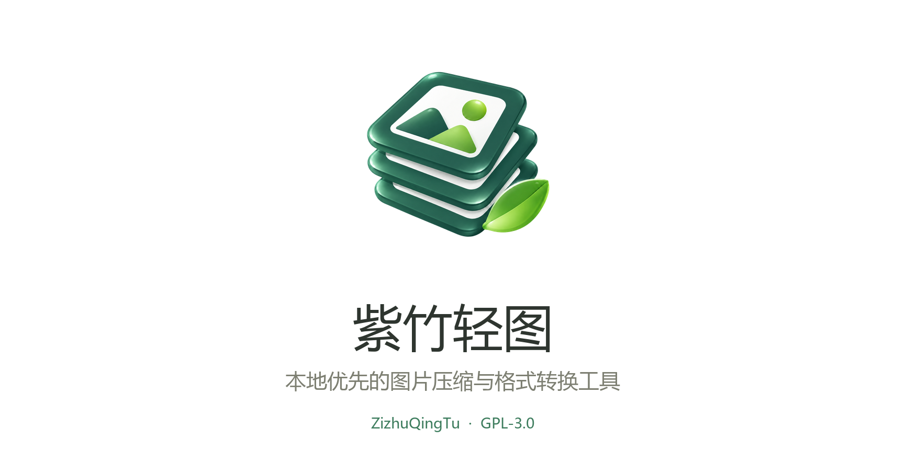

# 紫竹轻图（ZizhuQingTu）

开源跨平台本地图片 / 动图压缩工具：智能择优压缩，本地文件夹监控，自定义悬浮窗；支持格式转换、批量压缩、添加水印、图床上传。支持 Windows、macOS、Linux 与可自托管 Web 端。

帮助自媒体工作人员和开发人员提升工作效率。

[English](README.en-US.md) · [问题反馈](https://github.com/zizhu-gezhu/zizhu-qingtu/issues)



## 主要能力

- JPEG / JFIF、PNG、WebP、GIF 导入、转换、压缩与等比例缩放
- 默认自动比较候选格式，在尽量保持观感的前提下选择更小结果
- 原图/结果对比、实时体积、连续画质与尺寸控制、文字水印
- 可将输出限制在 200 KB、100 KB、50 KB 或自定义大小，按真实编码结果自动调整画质与尺寸
- 支持一次导入整个文件夹并递归加入其中图片，大批量导入沿用低内存队列
- 剪贴板监听、全局快捷键、文件夹监测与本地图库
- 类 Clop 的桌面悬浮结果：复制、预览、撤销、继续缩小、切换格式，并在左下状态位反馈操作成功或失败
- 结果数量上限、堆叠/展开两种悬浮布局、自动隐藏
- 可禁止系统截图与录屏捕获悬浮结果；macOS 与 Windows 桌面端均支持，第三方捕获工具是否遵循由其实现决定
- 覆盖源文件、同目录重命名或固定目录输出，并支持定期清理
- WebDAV、S3/R2、OSS、FTP、SFTP 图床上传
- 内置批量重命名、格式转换、尺寸调整与扩图插件；也可加载本地 HTML/JavaScript 或 URL 工作台插件
- Tauri 2 + Rust 桌面端；图片默认只在本机处理

### 内置插件：批量重命名

批量重命名作为独立插件页面提供：从任意层级父目录提取正则分组、补零并通过模板生成文件名，执行前可预览冲突；自定义规则可以另存、覆盖并自动记住上次设置，文件夹监控也可复用同一套父目录命名规则。

### 内置插件：格式转换、尺寸调整与扩图

格式转换插件批量输出 JPEG、WebP 或 PNG，可选择无损优先、智能平衡、更小体积或手动画质。尺寸插件使用 SIMD 加速的 Lanczos3 缩放，支持等比百分比、指定单边、适应宽高边界和精确尺寸；两者都能把参数直接带入新的文件夹监控任务。

### 悬浮窗工作流

桌面端可通过全局快捷键、复制图片、拖放文件或“选择本地图片”唤出悬浮窗，无需先打开完整工作台。图片完成自动择优后，把鼠标移到预览图上即可复制、预览、定位文件、撤销、继续缩小、切换格式、加水印或上传图床。悬浮结果支持拖动和缩放、堆叠循环与展开布局、数量上限和自动隐藏，并可在设置中自由选择最多 6 个操作按钮。

### 多任务文件夹监控

在“文件夹监测”主页面添加并保存任务。A、B、C 等互不重叠的目录可同时启用，每个任务独立配置目标格式、质量、缩放、最大宽高、输出位置、命名规则、完成通知和悬浮结果。保存后立即生效，软件重启后自动恢复；软件需保持运行（可最小化到托盘）。

“仅格式或尺寸不符合时处理”会跳过已经满足目标的图片；关闭此项则对新图片执行压缩。尺寸可选择仅缩小、等比适应边界并允许放大，或精确宽高。启用父目录命名后，即使格式尺寸符合仍会生成命名后的结果；命名规则与批量重命名插件相同。监控不使用批量序号，请以 `{name}` 区分图片。

原图保留，结果保存到各自指定的位置。监控等待文件写入稳定，忽略已生成结果，并拦截目录重叠或输出形成循环的配置。处理成功显示悬浮结果，可同时发送系统通知（受系统通知设置影响）。

JFIF 按 JPEG 图片支持导入、压缩、转换、监控与重命名；本版本不直接拆包或重打包 EPUB，请先提取其中图片。

## Docker

Web 端是无需安装的静态版本，图片直接在浏览器本地处理，不会上传到服务器。系统托盘、全局快捷键、剪贴板持续监听和文件夹监测等系统级功能请使用桌面端。

需要局域网访问、固定域名或自己的服务入口时，可使用镜像部署 Docker 版本。默认服务端口为 `3456`。

### Docker Compose（推荐）

```bash
git clone https://github.com/zizhu-gezhu/zizhu-qingtu.git
cd zizhu-qingtu
docker compose pull
docker compose up -d
```

升级、查看状态和日志：

```bash
docker compose pull
docker compose up -d --remove-orphans
docker compose ps
docker compose logs -f zizhu-qingtu
```

可在项目目录创建 `.env` 修改监听地址、宿主机端口或版本：

```dotenv
ZIZHU_QINGTU_BIND=0.0.0.0
ZIZHU_QINGTU_PORT=3456
ZIZHU_QINGTU_TAG=1.0.0
```

如需从当前源码本地构建：

```bash
docker compose -f docker-compose.yml -f docker-compose.build.yml up -d --build
```

### Docker Run

```bash
docker run -d \
  --name zizhu-qingtu \
  -p 3456:3456 \
  --restart unless-stopped \
  ghcr.io/zizhu-gezhu/zizhu-qingtu:latest
```

浏览器打开 `http://服务器IP:3456`。Web 端保留压缩工作台；受浏览器权限限制，不提供系统托盘、全局快捷键和持续文件夹监测。

反向代理时将域名转发至 `http://127.0.0.1:3456`。例如 Caddy：

```caddyfile
zizhu-qingtu.example.com {
  reverse_proxy 127.0.0.1:3456
}
```

## 本地开发

要求 Node.js 22.13+、Rust stable，以及目标平台的 Tauri 2 系统依赖。

> Windows 额外要求：
> 1. **MSVC 生成工具**（勾选“使用 C++ 的桌面开发”）与 **Rust**（`rustup`）；
> 2. **Strawberry Perl** —— `ssh2` 依赖 `vendored-openssl`，需要 perl 编译 OpenSSL，而 Git 自带的精简版 perl 缺模块；
> 3. ⚠️ **项目路径必须为纯英文**。中文路径会让 OpenSSL 的 perl/nmake 把文件写进乱码目录，导致构建失败。

```bash
npm install
npm run dev
npm run desktop:dev
```

验证与构建：

```bash
npm test
npm run desktop:build
```

## 创建工作台插件

### 内置插件：图片批量重命名

在主窗口打开“批量重命名”并选择根目录（默认启用，可在“设置 → 插件”中关闭）。递归扫描只处理图片，保留其它文件。从图片所在文件夹向根目录逐层匹配，遇到第一个匹配的父目录就停止。

- `A/A1/A11/【1-1】A111/A1111/photo.jfif`，默认规则生成 `0101_photo.jfif`，直接位于 `【1-1】A111` 下的图片同样适用。
- 两段数字分别补至两位：`1-1 → 0101`、`11-1 → 1101`；更长数字保留，不截断。
- 中文词：规则 `(风景|人物)` 配合 `{1}_{name}`；英文词：`([A-Za-z]+)` 配合 `{1}_{name}`。
- 英文首字母：`{1:initial}` 取捕获内容的首字母；`{1:initials}` 提取各单词首字母，例如 `New York → NY`。
- 模板还支持 `{code}`、`{name}`、`{ext}`、`{folder}`、`{match}`、`{1}`、`{2}`、`{index}`、`{index:03}`。零捕获组时 `{code}` 使用整个匹配文本。

执行前先扫描预览；未匹配和冲突项会标明，不覆盖已有文件。修改后的正则、模板、连接符与转换设置可以另存为自定义规则或覆盖已有自定义规则，软件也会自动恢复上次使用的规则。

插件不再用 `iframe` 嵌入。桌面端会读取 HTML/CSS/JavaScript，并挂载到工作台的可信插件容器；因此不会被站点的 `X-Frame-Options` 阻止，也支持自定义标签名称。请只安装你信任的代码。

最小插件只需一个 HTML 文件：

```html
<!doctype html>
<meta charset="utf-8">
<main id="tool">
  <h1>我的图片工具</h1>
  <button id="ready">完成</button>
</main>
<script>
  document.querySelector("#ready").onclick = () => {
    window.PicLitePlugin.post("ready", { ok: true });
  };
</script>
```

打开“设置 → 插件”，可直接导入 `.html`、`.js` 或 `manifest.json`；也可填写自定义名称和 HTTPS 地址，由桌面端读取后运行。清单示例：

```json
{
  "nameZh": "封面设计大师",
  "nameEn": "Banner Maker",
  "url": "https://example.com/plugin/"
}
```

完整的运行时 API、资源路径规则和发布注意事项见[插件开发教程](docs/PLUGIN_DEVELOPMENT.md)。

## 隐私与许可证

图片压缩默认在浏览器或桌面客户端本地完成；只有主动使用图床上传时，文件才会发送到你配置的服务。

紫竹轻图基于 [PicLite](https://github.com/amiaoapp/PicLite)修改，使用 [GPL-3.0-or-later](LICENSE) 许可。桌面自动化工作流借鉴并改编自 GPL 项目 [FuzzyIdeas/Clop](https://github.com/FuzzyIdeas/Clop)，本项目不使用 Clop 商标；详情见 [THIRD_PARTY_NOTICES.md](THIRD_PARTY_NOTICES.md) 与 [NOTICE.md](NOTICE.md)。
